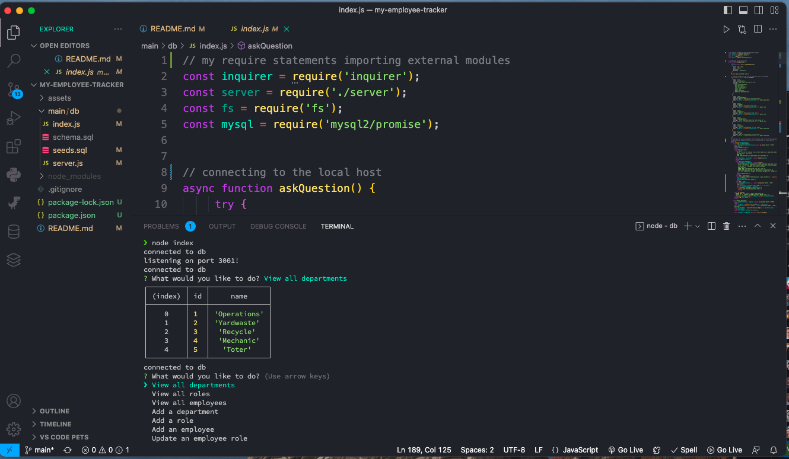
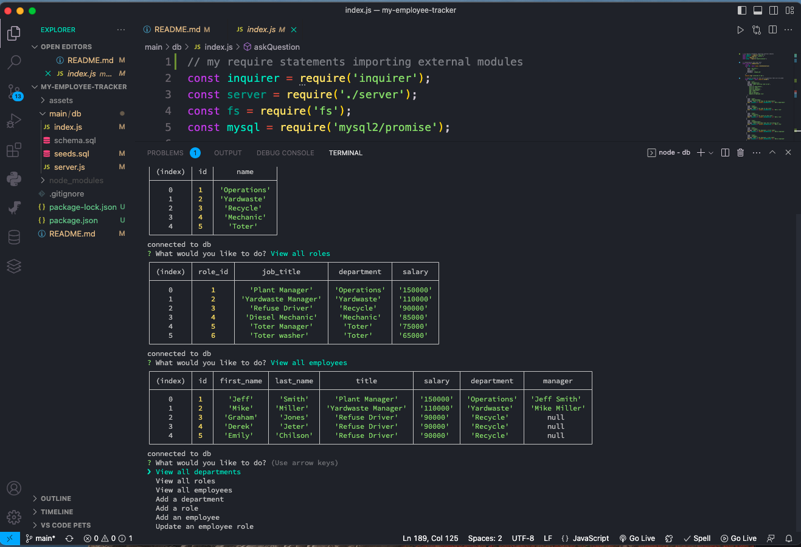
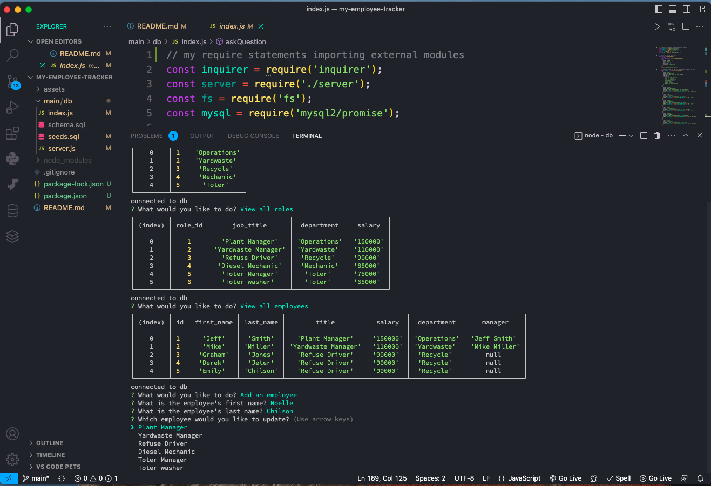

# my-employee-tracker

## Description
Built a employee tracker using command-line application that takes in user input and updates tables with the info. A business owner can use this app to manage departments, roles, and employees in a company. When the app starts it gives you a list of options to choose from, like view departments or employees. You can also update roles, add employees, or update an employee. Once you choose one of the options your asked questions and once done then it updates the tables with the new information you provided.

I learned a lot and still don't know a lot about sql but I am trying my hardest to get the grasp of the new stuff I'm learning and implementing it into new projects.

## Usage

Here is a few screenshots of the app being used, and also a link to the "how to" video showing how to use this app. There is also a link to my github repo for this app.

Github link to repo: https://github.com/Derekchili/my-employee-tracker.git

Video link: https://drive.google.com/file/d/1bNks3jzYTHoa3zTISfcXOuxcNT6DsDd7/view

## Credits

Had some help from a classmate who knows mysql better than me Will Asbury. Also had some good help from a tutor Andres Jiminez he helped me get some of the wording right in the INSERT part of it.

